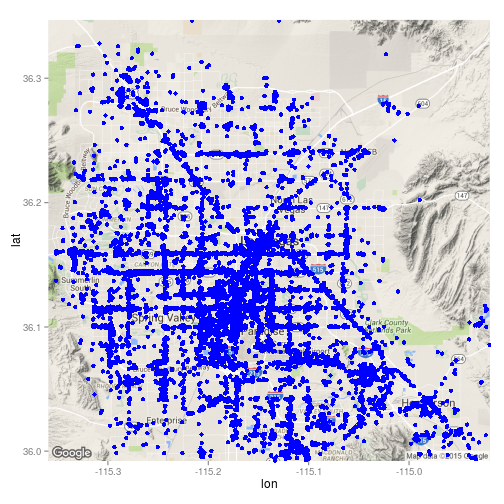
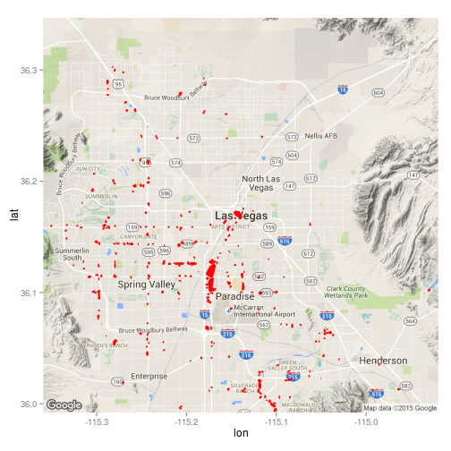

Detecting commericial areas using Yelp data
========================================================
author: 
date: 21/11/2015

Primary Question
========================================================


- Detecting commercial areas using yelp data 
- Detecting areas of interest and higher activity
- Building polygon bounds for the area of interest

Data Used
========================================================
The businesses present in the Las Vegas area.
 

Method Used
========================================================

- Density based spatial clustering~(DBSCAN)

```r
#db <- dbscan(businessDataN,eps = 0.0009,MinPts = 10)
load("~/courCap/db.RData")
businessData$db <- as.numeric(db$cluster)
clustData <- businessData[businessData$db != 0,]
clustData <- clustData %>% select(longitude,latitude,db) 
```
- Minimum Covex polygon creation for getting polygons from clustered data


Results of Density based clustering
========================================================

The results of density based spatial clustering algorithm and polygons of interest found.
 

Discussion
========================================================

- Areas of interest were detected by using a simple density based clustering algorithm.
- The results show that high areas with higher activity were detected.
- Useful for tourists. local shopers and city planners.

